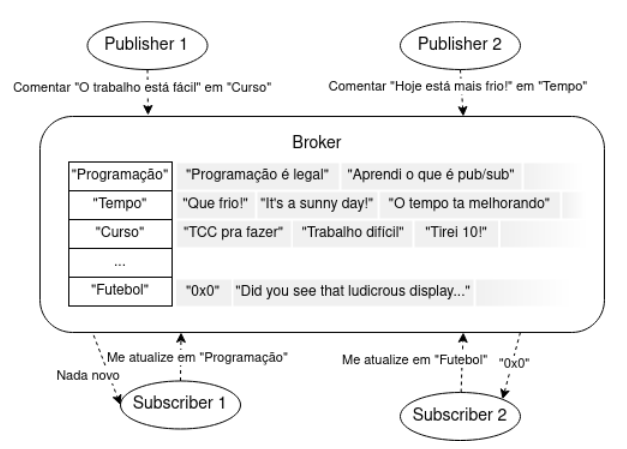

# Implementation of a Pub/Sub Service Functioning as a Social Media Feed

First of all, this was an optional assignment developed in the parallel and distributed programming subject (INE5645).

### Project description

Publishers are those who produce comments on the social media platform, with each comment associated with a topic. Subscribers are those interested in specific topics.

- Each comment consists of text and is associated with a single topic.

- A broker node stores the topics received from publishers, maintaining a set of comments for each topic. When receiving requests for updates on a topic of interest it should send the most recent comments not yet received by the subscriber. Upon receiving a request to publish a new comment, it stores the received comment.

- Each publisher sends comments to the broker.

- Each subscriber requests updated comments on topics they are subscribed to.

### Other requirements:

- Communication must be implemented using sockets or MPI. If you choose to use MPI, collective communication resources or MPI implementations of patterns such as scatter/gather and map/reduce cannot be used.

- Each communication performed must be displayed on the screen (print).

- For testing and simulation, configuration files should be created with the following settings:

    - For the publisher: its own address, the broker's address, and a list of pairs (comment, topic) to be sent to the broker throughout the execution.

    - For the subscriber: its own address, the broker's address, and a list of subscribed topics.

    - The broker's configuration contains only its own address.

    - Publications and update requests should be made at random intervals of 1 to 2 seconds.

### Supporting image



### How to run the code

You need to initialize at least 3 instances of terminals. One to run the broker, other to run one subscriber, and the other to run the producer. If you want to run more than one producer or subscriber, just open more terminal instances.

Fom the root of the project:

- Run the broker:
    ```
    python3 broker/broker.py
    ```
- Run one (or two) publisher(s):
    ```
    python3 publishers/publisher.py publishers/publisher1_config.json 
    ```

    ```
    python3 publishers/publisher.py publishers/publisher2_config.json 
    ```

    Note that json file in the second argument is the configuration file of publisher.

- Run one (or two) subscriber(s):
    ```
    python3 subscribers/subscriber.py subscribers/subscriber1_config.json
    ```

    ```
    python3 subscribers/subscriber.py subscribers/subscriber3_config.json
    ```

    Like the publishers, the second argument is the configuration file of subscriber.

